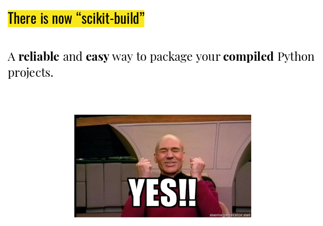

**scikit-build** is an improved build system generator for CPython C/C++/Fortran/Cython
extensions. It provides better support for additional compilers, build
systems, cross compilation, and locating dependencies and their associated
build requirements.

The **scikit-build** package is fundamentally just glue between
the `setuptools` Python module and [CMake](https://cmake.org/).

To get started, see http://scikit-build.readthedocs.io.

### scikit-build talk

* slides: https://bit.ly/scikit-build-talk
* pdf: [scipy_2018_scikit-build_talk.pdf](scipy_2018_scikit-build_talk.pdf)
* video: https://www.youtube.com/watch?v=QVkg-cC5oe4

### "The Sheer Joy of Packaging" tutorial

* website: https://python-packaging-tutorial.readthedocs.io
* video: https://www.youtube.com/watch?v=uKY2OGS-BwY

