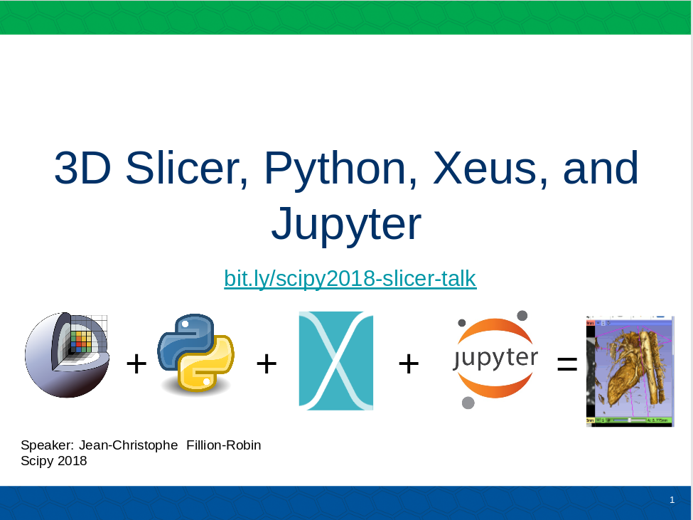

**3D Slicer** is software for medical image computing and visualization.

To learn more about **3D Slicer** and get started, see https://download.slicer.org.

The goals of this lightning talk were to:
* Introduce 3D Slicer ecosystem , application and community
* Describe Python and Jupyter integration using [xeus](https://github.com/QuantStack/xeus)

Links:

* slides: https://bit.ly/scipy2018-slicer-talk
* pdf: [scipy_2018_slicer-python-jupyter-and-xeus.pdf](scipy_2018_slicer-python-jupyter-and-xeus.pdf)

---

