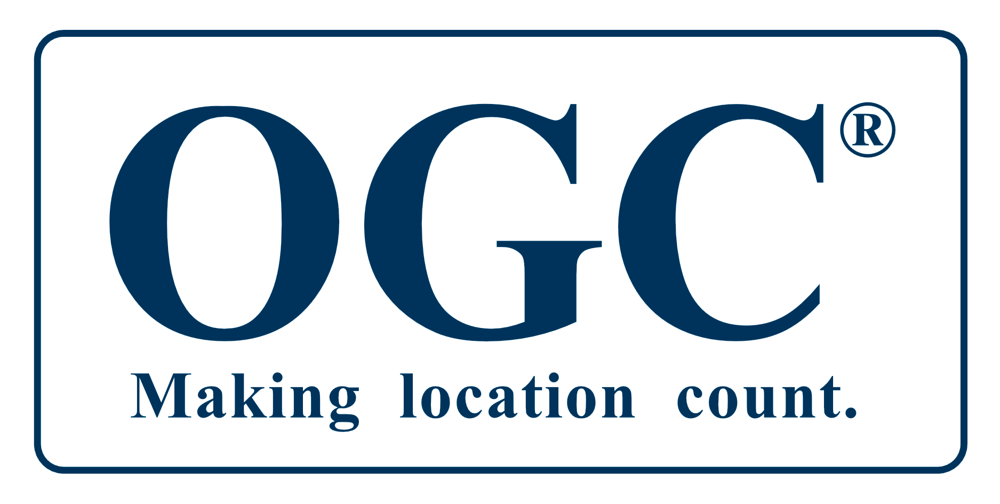

# `whoami`

Filipe Fernandes

>- Physical Oceanographer
>- Data Plumber
>- Code Janitor
>- CI babysitter
>- Amazon-Dash-Button for conda-forge


# Previous talks: standards

<iframe width="700" height="500" src="https://www.youtube.com/embed/BV30Sk1CrM0?start=1771" frameborder="0" allow="encrypted-media" allowfullscreen></iframe>

[https://www.youtube.com/watch?v=BV30Sk1CrM0](https://www.youtube.com/watch?v=BV30Sk1CrM0)


# Previous talks: ocean models

<iframe width="700" height="500" src="https://www.youtube.com/embed/WHjU_rg81BI?start=1771" frameborder="0" allow="encrypted-media" allowfullscreen></iframe>

[https://www.youtube.com/watch?v=WHjU_rg81BI](https://www.youtube.com/watch?v=WHjU_rg81BI)


# IOOS


# IOOS numbers  


# Code gallery


[http://ioos.github.io/notebooks_demos/code_gallery](http://ioos.github.io/notebooks_demos/code_gallery)


# Standards

<p>



</p>

>- avoid customer-specific solutions
>- the standardizations happen at the data providers 

. . .


# IOOS Web Services

| Data Type                              | Web Service                       | Response     |
|----------------------------------------|-----------------------------------|--------------|
| In-situ data<br>(buoys, stations, etc) | OGC SOS                           | XML/CSV      |
| Gridded data (models, satellite)        | OPeNDAP                           | Binary       |
| Raster Images                          | OGC WMS                           | GeoTIFF/PNG |


. . .

There is also `ERDDAP` emerging as a community standard.

# Sensor Observation Service

(OGC SOS)

>- `GetCapabilities`: metadata
>- `DescribeSensor`: detail info on the instruments
>- `GetObservation`: the data


# SOS example

```python
url = (
    'https://opendap.co-ops.nos.noaa.gov/ioos-dif-sos/SOS?'
    'service=SOS'
    '&request=GetObservation'
    '&version=1.0.0'
    '&observedProperty=water_surface_height_above_reference'
    '&offering=urn:ioos:station:NOAA.NOS.CO-OPS:8454000'
    '&responseFormat=text/csv'
    '&eventTime=2018-07-04T00:00:00Z/2018-07-05T00:00:00Z'
    '&result=VerticalDatum==urn:ogc:def:datum:epsg::5103'
    '&dataType=PreliminarySixMinute'
)
```

# If we add Python to it

```python
url = (
    f'https://opendap.co-ops.nos.noaa.gov/ioos-dif-sos/SOS?'
    f'service=SOS&request={request}'
    f'&version={version}'
    f'&observedProperty={variable}'
    f'&offering=urn:ioos:station:NOAA.NOS.CO-OPS:8454000'
    f'&responseFormat={response}'
    f'&eventTime={yesterday:%Y-%m-%dT%H:%M:%SZ}/'
    f'{today:%Y-%m-%dT%H:%M:%SZ}'
    f'&result=VerticalDatum=={vdatum}'
    f'&dataType={data_type}'
)
```

. . .

<a href="http://localhost:8888/notebooks/00-SOS.ipynb">
  
</a>


# OPeNDAP/Climate and Forecast 

(CF)


<iframe src="http://cfconventions.org/" width="750px" height="450px"></iframe>

# CF - Metadata

```xml
float temp(ocean_time, s_rho, eta_rho, xi_rho);
    temp:standard_name = "sea_water_potential_temperature"
    temp:units = "Celsius";
    temp:coordinates = "lon_rho lat_rho s_rho ocean_time";
double s_rho(s_rho);
    s_rho:long_name = "S-coordinate at RHO-points";
    s_rho:positive = "up";
    s_rho:standard_name = "ocean_s_coordinate_g1";
    s_rho:formula_terms = "s:s_rho C:Cs_r eta:zeta depth:h
                           depth_c:hc"
```

. . .

<a href="http://localhost:8888/notebooks/01-ClimateForecast.ipynb">
  
</a>


# Web Mapping Service

(OGC WMS)

>- Simple HTTP interface for requesting geo-registered map images
>- A WMS request defines the geographic layer(s) and area of interest to be processed
>- The response to the request is one or more geo-registered map images (returned as JPEG, PNG, etc) 

. . .

<a href="http://localhost:8888/notebooks/02-WMS.ipynb">
  
</a>

# ERDDAP

The data server that the community is demanding

>- Flexible outputs: `.html` table, ESRI `.asc` and `.csv`, Google Earth `.kml`, OPeNDAP binary, `.mat`, `.nc`, ODV `.txt`, `.csv`, `.tsv`, `.json`, and `.xhtml`
>- Free RESTful API to access the data
>- Standardize dates and time in the results
>- Server-side searching and slicing

. . . 

<a href="http://localhost:8888/notebooks/03-ERDDAP.ipynb">
  
</a>


# There are many moving parts


# Catalog Service for the Web

(CSW)

>- A single source to find endpoints
>- Nice python interface:<br>`owslib.csw.CatalogueServiceWeb`
>- Advanced filtering:<br>`owslib.fes`

. . . 


# Harvesting


# Finding the web services


```python
>>> from geolinks import sniff_link
>>> sniff_link('http://host/wms?service=SOS')
'OGC:SOS'
>>> sniff_link('http://host/wms?service=OPeNDAP:OPeNDAP')
'OPeNDAP:OPeNDAP'
>>> sniff_link('http://host/wms?service=WMS')
'OGC:WMS'
>>> sniff_link('http://host/data/roads.kmz')
'OGC:KML'
>>> sniff_link('http://host/data/roads.kml')
'OGC:KML'
```

. . .

<a href="http://localhost:8888/notebooks/04-CSW.ipynb">
  
</a>


# Putting it all together: NHC

Meteorological stations in a National Hurricane Center path prediction.

<a href="http://localhost:8888/notebooks/2017-09-09-hurricane_irma.ipynb">
  
</a>


# Putting it all together: Model skill

Modeled Significant Wave Height skill

<a href="http://localhost:8888/notebooks/2018-03-30-wave_height_assessment.ipynb">
  
</a>

# Putting it all together: ERDDAP App

Finally the title notebook!

<a href="http://localhost:8888/notebooks/ERDDAP_timeseries_explorer-IOOS.ipynb">
  
</a>


# SECOORA Portal

<iframe width="700" height="500" src="https://portal.secoora.org"></iframe>


# Summary

>- Standards, web services and catalogs allow us to serve data in a unified way
>- Python powered Jupyter gives us a powerful scientific, analysis and visualization environment to fetch
>- Widgets allow for fancy data exploration


# Questions?

#### ([ocefpaf]((https://github.com/ocefpaf)))


... g-mail, google+, etc.


[https://ocefpaf.github.io/2018-SciPy-talk](https://ocefpaf.github.io/2018-SciPy-talk)

[](https://mybinder.org/v2/gh/ocefpaf/2018-SciPy-talk/gh-pages)